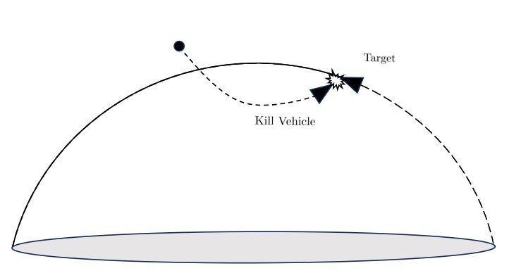

# 중간단계 탄도미사일 요격을 위한 우주기반 요격체 유도제어
* 2023 항공우주학회 추계학술대회 발표 [DBPia](https://www.dbpia.co.kr/journal/articleDetail?nodeId=NODE11658039)

## 개요
* 탄도미사일의 기술이 발전하는 상황에서, 방어 대책 또한 지속적으로 발전하고 연구되어야 함
* 탄도미사일을 요격하는 방안으로 우주환경에서 상주하는 요격 체계가 연구된 바가 있음
* 이에 우주기반 요격체를 통해 탄도미사일을 요격하기 위한 제어 법칙을 설계하고,   교전 시뮬레이션을 통해 요격체의 유효성을 확인하고자 함

  

## 제어 법칙 구성
* 외기권 환경에서 공력에 의한 Disturbance가 없다고 가정한다
* Quaternions 회전 좌표를 기반으로 PD 제어기 적용
* 요격체의 운동이 순수 추력에 의존하는 외기권 환경을 고려하여 TPNG 유도 법칙 적용 

  

## 탄도 미사일 정의
* 탄도 미사일은 초기 부스팅 이후 지구의 중력을 중심으로 타원 궤도로 비행한다고 가정
* Kepler 6 Parameter 로 탄도 미사일의 궤적을 정의

  

## 시뮬레이션 결과
* 요격체의 초기 각도, 비행 속도, 탄도 미사일의 교전 초기 속도에 따라 요격 가능 여부가 변화하는 모습을 확인

  

